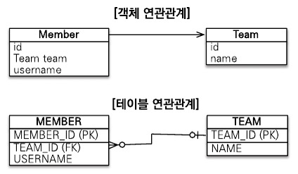

# jpa 공부를 위한 프로젝트

## 📆 진행 기록 (Progress Timeline)
- 2025-07-06
  - 스프링 부트 프로젝트 생성 (start.spring.io 사용)
  - view, controller 테스트
  - h2 db 설치
- 2025-07-10
  - 엔티티 설계 시작
- 2025-07-12
  - 엔티티 설계 완료
- 2025-07-13 (기능 구현 시작)
  - 회원 도메인 개발
    - 회원 기능 구현 (repository 및 service)
      - 회원 등록
      - 회원 목록 조회
    - 회원 기능 테스트
- 2025-07-14
  - 상품(`Item`) 도메인 개발
    - 상품 등록
    - 상품 목록 조회
    - 상품 수정
  - 주문(`Order`,`OrderItem`) 도메인 개발
    - 상품 주문
    - 주문 취소
- 2025-07-15
  - 주문(`OrderSearch`) 도메인 개발
    - 주문 검색 기능 (현재는 jpql로 구현. 추후 QueryDSL로 수정할 계획)
- 2025-07-16
  - 회원 기능 개발
    - 회원 등록
    - 회원 조회
- 2025-07-17
  - 상품 기능 개발
    - 상품 등록
    - 상품 조회
    - 상품 수정
- 2025-07-18
  - 주문 기능 개발
    - 주문 등록
    - 주문 조회
    - 주문 취소
- 2025-07-21
  - API 개념 공부
  - 서블릿 사용 공부
  - 회원 등록 API 개발
- 2025-07-22
  - 회원 수정 API 개발

## 📘 Spring MVC 개념
- 서버의 데이터를 동적으로 렌더링하는 2가지 방법 (SSR vs CSR)
  - SSR : Server Side Rendering
    - 서버에서 HTML을 만들면서 데이터를 직접 넣음
    - 템플릿 엔진을 사용해야 함. (Thymeleaf, JSP 등)
  - CCR : Client Side Rendering
    - 서버는 데이터를 JSON으로만 응답
    - 클라이언트는 받은 데이터를 바탕으로 HTML을 구성하거나 일부를 바꿈

- @Valid 어노테이션은 사용자가 입력한 값(폼 데이터, 요청 DTO 등)을 자동으로 유효성 검사할 수 있게 해준다.
  @Valid를 메서드의 파라미터 앞에 붙이면, 해당 객체에 선언된 검증 조건(예: @NotEmpty, @Size, @Email 등)에 따라 자동으로 유효성 검사가 이루어진다.
- BindingResult는 Spring MVC에서 유효성 검증(Validation) 결과를 담는 객체이다.
  @Valid 또는 @Validated 어노테이션을 통해 객체 검증을 수행했을 때, 오류가 발생해도 예외를 던지지 않고, 그 오류 정보를 BindingResult에 담아준다. 즉, 컨트롤러 로직을 계속 진행할 수 있게 해준다.


## 📘 JPA 개념
- JPA(Java Persistence API)는 객체와 관계형 데이터베이스 간의 패러다임 불일치를 해결하기 위한 ORM(Object-Relational Mapping) 표준 인터페이스이다.

- 영속성(Persistence)
  - 영속성 컨텍스트(persistence context)는 '엔티티를 영구 저장하는 환경'이다.
  - 엔티티 매니저의 `persist()` 메소드를 사용하면, 엔티티를 영속성 컨텍스트에 저장하는 것이다.
  - 보통은 엔티티 매니저당 하나의 영속성 컨텍스트가 만들어지고, 상황에 따라서 여러 엔티티 매니저가 같은 영속성 컨텍스트에 접근할 수도 있다.
- 엔티티의 생명주기
  - 비영속: 영속성 컨텍스트와 전혀 관계가 없는 상태
  - 영속: 영속성 컨텍스트에 저장된 상태
  - 준영속: 영속성 컨텍스트에 저장되었다가 분리된 상태
  - 삭제: 삭제된 상태
- 엔티티 맵핑 어노테이션
  - @Entity
    - JPA를 사용해서 테이블과 매핑할 클래스 지정
      - name: JPA에서 사용할 엔티티 이름. 기본값은 클래스 이름
    - 기본 생성자 필수(파라미터가 없는 public 또는 protected 생성자)
    - final 클래스, enum, interface, inner 클래스에는 사용 불가
    - 저장할 필드에 final을 사용하면 안됨.
  - @Table
    - 엔티티와 매핑할 테이블을 지정.
      - name: 매핑할 테이블 이름. 기본값은 엔티티 이름
      - catalog: 데이터베이스의 catalog 매핑
      - schema: 데이터베이스의 schema 매핑
      - uniqueConstraints(DDL) : DDL 생성 시, 유니크 제약조건을 만듦.
  - @PersistenceContext는 스프링이 관리하는 EntityManager를 자동 주입해주는 어노테이션이다.


- EntityManager 주요 기능 정리표

  | 메서드                                             | 기능           | 설명                                                            |
  | ----------------------------------------------- | ------------ | ------------------------------------------------------------- |
  | `persist(Object entity)`                        | **등록**       | 새 엔티티를 영속성 컨텍스트에 저장 (INSERT 예정)                               |
  | `find(Class<T> entityClass, Object primaryKey)` | **단건 조회**    | 기본 키(PK)로 엔티티 조회                                              |
  | `createQuery(...)`                              | **JPQL 실행**  | JPQL 쿼리 실행 (객체 중심 질의)                                         |
  | `createNativeQuery(...)`                        | **SQL 실행**   | 순수 SQL 쿼리 실행                                                  |
  | `remove(Object entity)`                         | **삭제**       | 엔티티를 영속성 컨텍스트 및 DB에서 삭제                                       |
  | `merge(Object entity)`                          | **병합(갱신)**   | 준영속(detached) 상태의 엔티티를 다시 영속 상태로 갱신                           |
  | `flush()`                                       | **동기화**      | 영속성 컨텍스트의 변경 내용을 DB에 반영 (SQL 실행)                              |
  | `clear()`                                       | **비우기**      | 영속성 컨텍스트 초기화 (1차 캐시 날림)                                       |
  | `detach(Object entity)`                         | **비영속화**     | 특정 엔티티만 영속성 컨텍스트에서 분리                                         |
  | `contains(Object entity)`                       | **영속 여부 확인** | 해당 엔티티가 영속 상태인지 확인                                            |
  | `getReference(...)`                             | **프록시 조회**   | 엔티티를 실제 조회하지 않고 프록시로 가져옴 (LAZY 로딩)                            |
  | `close()`                                       | **종료**       | EntityManager 종료 (더 이상 사용 불가)                                 |
  | `getTransaction()`                              | **트랜잭션 제어**  | `begin()`, `commit()`, `rollback()` 등을 통해 수동 트랜잭션 제어 (JPA 표준) |


- 일대다(1:N) 양방향 관계 설정

| 항목                | 설명                                    |
| ----------------- | ------------------------------------- |
| 연관관계의 주인          | 외래 키를 가진 쪽 (DB에 실제로 반영되는 쪽)           |
| mappedBy          | 주인이 **아닌 쪽**이 사용. 상대편 클래스의 참조 필드명을 적음 |
| @JoinColumn(name) | 주인 쪽에서 사용. 내 테이블에 생성될 **FK 컬럼명** 지정   |
| 일대다 관계에서의 주인      | 항상 **다(N)쪽**이 주인 (외래 키를 가지기 때문)       |
| FK가 N쪽에 있는 이유     | 1NF 위반 방지, 현실 모델링과 일치, 성능 및 관리 용이성    |

- 다대다(N:N) 관계에서 `@ManyToMany`로 설정시 `@JoinTable` 내부 속성 의미
  - 실무에서는 `@ManyToMany`를 쓰지 말자
  - `@ManyToMany`에서는 fetch 기본값이 LAZY이다.
    | 속성명                  | 설명                             |
    | -------------------- | ------------------------------ |
    | `name`               | 중간 테이블 이름                      |
    | `joinColumns`        | **내 쪽(FK)** 설정 (`@JoinColumn`) |
    | `inverseJoinColumns` | **상대쪽(FK)** 설정 (`@JoinColumn`) |


- CascadeType.ALL

| 항목                | 설명                                  |
| ----------------- | ----------------------------------- |
| `CascadeType.ALL` | 저장, 삭제, 병합 등 모든 작업을 전파              |
| 언제 사용?            | 자식 엔티티의 생명주기가 부모에 종속될 때             |
| 언제 피해야 하나?        | 자식이 여러 곳에서 공유되는 경우 (예: 공통 코드, 유저 등) |
| 기본값               | cascade는 기본적으로 설정되지 않음 (직접 명시 필요)   |

- InheritanceType 전략 종류

| 전략                | 설명                         | 특징                              |
| ----------------- | -------------------------- | ------------------------------- |
| `SINGLE_TABLE`    | 하나의 테이블에 모든 자식 클래스 데이터를 저장 | ✅ 성능 좋음, 구조 단순<br>❌ null 컬럼 많아짐 |
| `JOINED`          | 부모/자식 각각 테이블 생성 + 조인       | ✅ 정규화됨<br>❌ 조인 많아져서 성능 낮음       |
| `TABLE_PER_CLASS` | 자식 클래스마다 테이블 따로 생성         | ❌ 잘 안 씀 (조회 비효율적)               |

- 도메인 모델 패턴과 트랜잭션 스크립트 패턴
  주문 서비스의 주문과 주문 취소 메서드를 보면 비즈니스 로직 대부분이 엔티티에 있다.
  서비스 계층은 단순히 엔티티에 필요한 요청을 위임하는 역할을 한다.
  이처럼 엔티티가 비즈니스 로직을 가지고 객체 지향의 특성을 적극 활용하는 것을 도메인 모델 패턴(http://martinfowler.com/eaaCatalog/domainModel.html)이라 한다.
  반대로 엔티티에는 비즈니스 로직이 거의 없고 서비스 계층에서 대부분의 비즈니스 로직을 처리하는 것을 트랜잭션 스크립트 패턴(http://martinfowler.com/eaaCatalog/transactionScript.html)이라 한다.

- 객체지향 쿼리
  - JPQL (Java Persistence Query Language)
    - 
  - Criteria Query
    - JPQL을 편하게 작성하도록 도와주는 API, 빌더 클래스 모음
    - 장점: 문자가 아닌 `query.select(m).where(...)`처럼 프로그래밍 코드로 JPQL을 작성할 수 있다.
      - 컴파일 시점에 오류를 발견할 수 있다.
      - IDE를 사용하면 코드 자동완성 지원
      - 동적 쿼리 작성 편함
    - 단점: 모든 장점을 상쇄할 정도로 복잡하고 장황하다.
  - QueryDSL
    - Criteria Query처럼 JPQL을 편하게 작성하도록 도와주는 빌더 클래스 모음, 비표준 오픈소스 프레임워크
    - 장점: 코드 기반이면서, 단순하고 사용하기 쉽다. (Criteria보다 훨씬 간단하다.)
  - 네이티브 SQL
    - JPA에서 JPQL 대신 직접 SQL을 사용할 수 있다.
    - 장점: 특정 데이터베이스에서만 동작하는 SQL을 작성할 수 있다.
    - 단점: 특정 데이터베이스에 의존하는 SQL을 작성해야 한다.


## 💡 Useful Tips
- **엔티티 매니저**
  - 엔티티 매니저는 만드는 비용이 상당히 크다. -> 한 개만 만들어서 어플리케이션 전체에서 공유하도록 설계.
  - 엔티티 매니저 팩토리는 여러 스레드가 동시에 접근해도 안전하므로 서로 다른 스레드 간에 공유해도 되지만, 엔티티 매니저는 여러 스레드가 동시에 접근하면 동시성 문제가 발생하므로 스레드 간에 절대 공유하면 안된다.
  - 근데, 결국 스프링 부트가 엔티티 팩토리 생성과 엔티티 매니저 생성을 다 알아서 해주게 된다... 이 얼마나 편한 세상...
- **연관관계**
  - 외래 키가 있는 곳을 연관관계의 주인으로 정해라.
    - ex) 자동차와 바퀴에서는 바퀴를 연관관계의 주인으로.
- JPA에서 @ManyToOne, @OneToOne은 기본이 EAGER라서 반드시 LAZY로 명시적으로 바꿔야 함!
  즉시 로딩은 관계가 복잡할수록 쿼리 폭발의 원인이 됨
  ``` java 
  @ManyToOne(fetch = FetchType.LAZY) // 👍 명시적으로 설정 추천!
  private Team team;
  ```
- 엔티티 설계시 주의사항
  - 엔티티에는 가급적 Setter를 사용하지 말자
    - setter가 모두 열려있다면 변경포인트가 너무 많아서 유지 보수가 어렵다. 리팩토링으로 Setter를 제거하자.
  - 모든 연관관계는 지연로딩으로 설정하자
    - 즉시로딩(EAGER)은 예측이 어렵고, 어떤 SQL이 실행될지 추적하기도 어렵다. 특히 JPQL을 실행할 때 N+1 문제가 자주 발생한다.
    - 실무에서 모든 연관관계는 지연로딩(LAZY)으로 설정해야 한다.
    - 연관된 엔티티를 함께 DB에서 조회해야 하면, fetch join 또는 엔티티 그래프 기능을 사용한다.
    - @XToOne(OneToOne,ManyToOne) 관계는 기본이 즉시로딩이므로 직접 지연로딩으로 설정헤야 한다.
  - 컬렉션은 필드에서 초기화 하자
    - null 문제에서 안전해진다.
    - 하이버네이트는 엔티티를 영속화 할 때, 컬렉션을 감싸서 하이버네이트의 내장 컬렉션으로 변경한다. 따라서 하이버네이트 내부 메커니즘과 꼬이지 않게, 필드 레벨에서 생성하는 것이 가장 안전하고 코드도 간결하다.
  - 스프링 부트에서 하이버네이트 기본 매핑 전략을 변경해서, 실제 테이블 필드명은 다르다.
  

- 왜 Date는 이제 잘 안 쓰는가

| `java.util.Date`    | `java.time.LocalDateTime` |
|---------------------| ------------------------- |
| 값 변경 가능 (mutable)   | 불변 객체                     |
| API가 불편함            | 가독성 좋고 체계적                |
| 시간대 개념이 섞여 있음       | 시간대 없음 (명확함)              |
| 혼란 유발 (월이 0부터 시작 등) | 직관적                       |
| @Temporal 필수 | @Temporal 없이도 TIMESTAMP 컬럼으로 자동 매핑 |

- `@Enumerated(EnumType.STRING)의 장점`
  - enum 순서가 바뀌거나 중간에 값이 추가되어도 전혀 문제 없음
  - 가독성도 좋고, 안전성도 높음

- 연관관계 편의 메서드
  - 편의 메서드(연관관계 메서드)를 어디에 둘지는 **연관관계의 주인 여부와는 별개**로 **객체 구조와 의미**를 기준(부모냐 자식이냐, 사용 흐름 등)으로 판단한다.
- 임베디드 타입(@Embeddable)은 자바 기본 생성자를 public 또는 protected로 설정해야 한다. public 보다는 protected가 그나마 더 안전.

- JPQL / CriteriaQuery에서는 엔티티(객체) 자체를 바인딩 값으로 넘길 수 있다. 내부적으로는 해당 엔티티의 식별자(ID) 값이 사용되어 비교가 이뤄진다.
  ```java
  em.createQuery("select o from Order o where member = :member", Order.class)
                .setParameter("member",member)
                .getResultList();
  ```

## Thymeleaf
- ### 📌 1. 서버 → HTML: 데이터 출력 바인딩  
  #### 🔧 사용 목적  
  서버 객체의 값을 HTML에 뿌려주기 (예: 회원 이름 리스트 출력, 기본값 설정 등)
  #### 💡 사용하는 속성들  
  
  | 타임리프 속성              | 역할                              |
  | -------------------- | ------------------------------- |
  | `th:object="${obj}"` | 폼 전체에 기본 객체 지정                  |
  | `th:field="*{속성}"`   | `th:object`로 지정된 객체의 속성을 필드에 연결 |
  | `${obj.prop}`        | 일반 텍스트 바인딩용 (읽기 전용)             |
  
  ✅ 예제
  ```java
  model.addAttribute("member", new Member("홍길동"));
  ```
  ```html
  <form th:object="${member}">
      <input type="text" th:field="*{name}" />
  </form>
  ```
  🔽 렌더링 결과:
  
  ```html
  <input type="text" name="name" id="name" value="홍길동" />
  ```

- ### 📌 2. HTML → 서버: 입력값 수신 바인딩
  #### 🔧 사용 목적
  사용자가 `<form>`에 입력한 데이터를 서버의 객체나 파라미터로 받기
  
  #### 💡 처리 방식
  ##### ① 객체 바인딩 방식 (@ModelAttribute 사용)
  ```html
  <form th:object="${member}" action="/save" method="post">
      <input type="text" th:field="*{name}" />
      <input type="text" th:field="*{email}" />
  </form>
  ```
  ```java
  @PostMapping("/save")
  public String saveMember(@ModelAttribute Member member) {
      // member.getName(), member.getEmail() 등 자동 바인딩
      return "redirect:/";
  }
  ```
  타임리프가 생성하는 `<input>`의 name 속성과 Java 필드명이 자동 매칭됩니다.
  
  ##### ② 개별 파라미터 바인딩 방식 (@RequestParam 사용)
  ```html
  <form action="/submit" method="post">
      <input type="text" name="name" />
  </form>
  ```
  ```java
  @PostMapping("/submit")
  public String handle(@RequestParam("name") String name) {
      // name = 사용자 입력 값
  }
  ```

- 타임리프에서 ?를 사용하면 null 을 무시한다.

## Spring Tips
- 필드 주입보다 생성자 주입이 좋은 이유

  | 항목          | 필드 주입 (`@Autowired`) | 생성자 주입 (`@RequiredArgsConstructor`) |
  | ----------- | -------------------- | ----------------------------------- |
  | **불변성**     | 주입 후에도 변경 가능         | 생성 시점 이후 값 변경 불가 (`final`)          |
  | **테스트 용이성** | DI 프레임워크 없이는 주입 불가   | 테스트 시 생성자로 직접 주입 가능                 |
  | **명확성**     | 의존성 보이지 않음           | 생성자를 통해 의존성 명확히 표현됨                 |
  | **컴파일 안정성** | 누락되어도 컴파일 됨 (런타임 오류) | 의존성 누락 시 컴파일 에러                     |
  | **순환참조 감지** | 늦게 발견됨               | 빨리 감지 가능 (생성자 주입 시점)                |
  | **리팩토링**    | 주입 대상 추적 어려움         | 생성자에 명시돼 추적 쉬움                      |

- 테스트 케이스를 위한 환경 설정
  - 테스트는 케이스 격리된 환경에서 실행하고, 끝나면 데이터를 초기화하는 것이 좋다. 그런 면에서 메모리 DB를 사용하는 것이 가장 이상적이다.
  - 추가로 테스트 케이스를 위한 스프링 환경과, 일반적으로 애플리케이션을 실행하는 환경은 보통 다르므로 설정 파일을 다르게 사용하자.
  - `test/resources/application.yml` 이 위치에 설정 파일이 없으면, `src/resources/application.yml`를 읽어 온다.
  - 스프링 부트는 datasource 설정이 없으면, 기본적을 메모리 DB를 사용하고, driver-class도 현재 등록된 라이브러를 보고 찾아준다. 추가로 ddl-auto 도 create-drop 모드로 동작한다. 따라서 데이터소스나, JPA 관련된 별도의 추가 설정을 하지 않아도 된다.
- JUnit과 AssertJ에서의 Assertions 클래스 충돌
  - Assertions 라는 클래스 이름이 JUnit과 AssertJ 모두에 존재.
    - org.junit.jupiter.api.Assertions → assertThrows(), assertEquals() 등
    - org.assertj.core.api.Assertions → assertThat(), assertThatThrownBy() 등
  - 그래서 두 라이브러리의 기능을 모두 사용하기 위해서는 static import를 사용해야 함.
    - 그러면 같은 이름의 클래스더라도 메서드만 개별적으로 사용 가능 + 가독성 향상
- SpringBoot 3.x.x 버전에서 P6Spy 적용하기 위해선 최소 1.9.0 이상의 버전을 사용해야 한다.
  `	implementation 'com.github.gavlyukovskiy:p6spy-spring-boot-starter:1.9.0'`

# 롬복
- @Data : `@Getter` , `@Setter` , `@ToString` , `@EqualsAndHashCode` , `@RequiredArgsConstructor` 를 자동으로 적용해준다.
- @AllArgsConstructor : 모든 필드를 파라미터로 받는 생성자 생성

# API 개발 중
- 스프링에서의 HTTP 응답 방법 3가지
  - 정적 리소스 (정적인 html 제공)
  - 뷰 템플릿 사용 (동적인 html 제공)
  - HTTP 메세지 사용 (JSON 등의 형식으로 데이터 제공)

- RestAPI 구성

  | 동작 (기능) | HTTP 메서드 | 요청 URL |
  |-------------|--------------|-----------|
  | Create      | `POST`       | `https://example.com/api/v1/books` |
  | Read (목록) | `GET`        | `https://example.com/api/v1/books` |
  | Read (단건) | `GET`        | `https://example.com/api/v1/books/1` |
  | Update      | `PUT`        | `https://example.com/api/v1/books/20` |
  | Partial Update | `PATCH`   | `https://example.com/api/v1/books/7` |
  | Delete      | `DELETE`     | `https://example.com/api/v1/books/123` |


- api 컨트롤러에서 엔티티를 그대로 쓰면 안되는 이유
  - presentation 계층(controller등)을 위한 검증 로직이 엔티티에 들어가면 안좋다. 같은 엔티티더라도 api 종류마다 검증해야 할 요소들이 다르기 때문이다.
  - 엔티티의 필드명이 바뀌게 되면 api 스펙 자체가 바뀌게 된다.
    - 엔티티는 굉장히 많은 곳에서 쓰이기 때문에 바뀔 확률이 굉장히 높다.
  - API 스펙을 위한 별도의 데이터 트랜스퍼 오브젝트, DTO를 만들어야 한다.
  - 엔티티를 이렇게 외부에서 json 오는 걸 바인딩 받는데 쓰면 안된다.
  - 그래서 그냥 API를 만들 때는 항상 엔티티를 파라미터로 받지 않는 게 좋다.
- 컨트롤러에 @ResponseBody를 붙이면 뷰 템플릿을 찾아 반환하지 않고, HTTP Body에 메세지를 넣어 응답하게 된다.
- @RestController = @Controller + @ResponseBody + α
- HTTP 요청 파라미터 - @RequestParam
  - HTTP 파라미터 이름이 변수 이름과 같으면 @RequestParam(name="xx") 생략 가능 (-parameters 옵션 필요)
  - String, int 등의 단순 타입이면 @RequestParam 도 생략 가능 (내부에서 `required=false`로 작동하게 됨) (-parameters 옵션 필요)
  - 하지만 어노테이션과 이름을 전부 입력해주는 것을 권장.
  - required = true면 해당 파라미터가 꼭 있어야 한다. 없을 시 예외 발생. (기본 값은 true)
  - defaultValue로 기본값을 설정할 수 있다. 빈 문자열의 경우도 기본값이 적용된다.
  - 파라미터를 Map, MultiValueMap으로 조회할 수 있다.
- HTTP 요청 파라미터 - @ModelAttribute
  - 요청 파라미터를 받아서 필요한 객체를 만들고 그 객체에 값을 넣어준다.
  - model.addAttribute() 코드도 함께 자동 적용된다.
  - `@ModelAttribute`도 `@RequestParam`와 마찬가지로 생략 가능하다.
    스프링은 해당 생략시 다음과 같은 규칙을 적용한다.  
    `String` , `int` , `Integer` 같은 단순 타입 = `@RequestParam`  
    나머지 = `@ModelAttribute` (argument resolver 로 지정해둔 타입 외)
- 요청 파라미터 vs HTTP 메시지 바디
  - 요청 파라미터를 조회하는 기능: `@RequestParam` , `@ModelAttribute`
  - HTTP 메시지 바디를 직접 조회하는 기능: `@RequestBody`